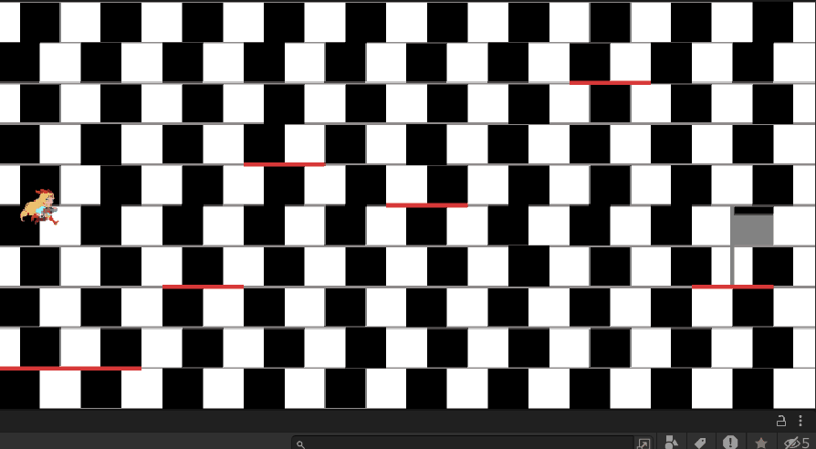
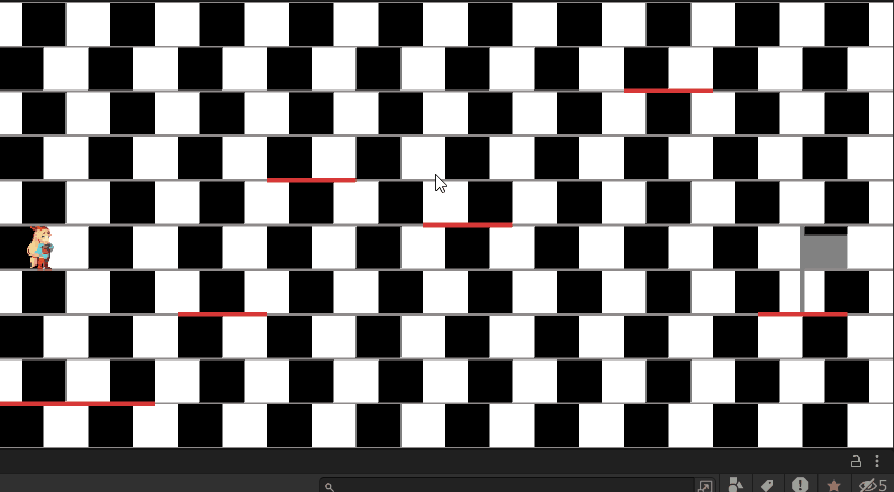

## 課題

**成功**

**失敗**

### 作品名（必須）
集中しましょう

### 目的（必須）
講義で学習した内容を用いて2Dのインタラクティブなコンテンツを開発する。

### 概要（必須）
認識しづらい画面でのアクションゲーム
カフェウォール錯視（方向の錯視）のある中で1つの行いに集中することができるか

### 使われている要素技術（必須）
キー入力、Vector演算
UIの配置、更新
Physics、飛行動作の実現、障害物設置、クリア判定
アニメーション、シーンの切り替え

### 作品の詳細（必須）
基本的にすべて2Dオブジェクトで作成。
キーを押している間(動いているとき)のみ走るアニメーションを表示した。

フレームアウトした時、強制リスタート。
ゴール(旗)に触れた時、クリア画面に遷移する。
遷移後何かしらのキーを押すことで元のゲーム画面に戻ることができる

[source on GitHub](./)

Copyright (c) 2023 peco2282

このプロジェクトは GNU LGPL の元で公開されています。

SEE [LICENSE](./LICENSE)

### 参考文献（必須）
画像

[unity-chan](https://unity-chan.com/)

錯視

[カフェウォール錯視](https://it-counselor.net/psychology-terms/optical-illusion#toc10)
